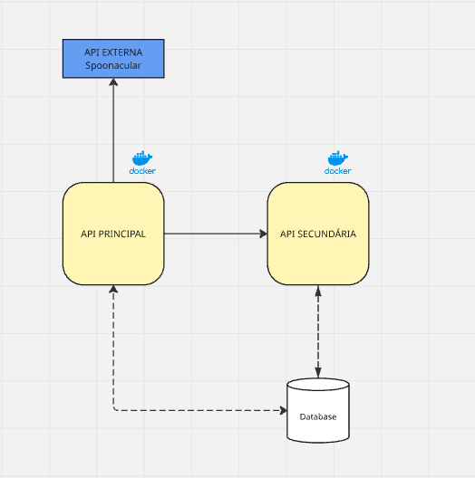

# API Secundária - Receitas Favoritas

## Descrição
A API Secundária é responsável por gerenciar receitas favoritas dos usuários. Ela permite adicionar, listar, buscar e remover receitas favoritas armazenadas em um banco de dados SQLite.

---

## Instalação e Configuração

### 1. Clonar o repositório
```sh
git clone <URL_DO_REPOSITORIO>
cd api_secundaria
```

### 2. Criar e ativar o ambiente virtual
```sh
python -m venv venv
# No Windows:
venv\Scripts\activate
# No Linux/macOS:
source venv/bin/activate
```

### 3. Instalar dependências
```sh
pip install -r requirements.txt
```

### 4. Configurar variáveis de ambiente
Crie um arquivo `.env` na raiz do projeto e defina as configurações necessárias, como a URL do banco de dados:
```
DATABASE_URL=sqlite:///database.db
```

### 5. Inicializar o banco de dados
```sh
python -c "from database import init_db; from app import app; init_db(app)"
```

### 6. Iniciar o servidor
```sh
python app.py
```
A API estará disponível em `http://localhost:5001`
 - Swagger: `http://localhost:5001/swagger`

---

## Endpoints Disponíveis

### 1. Adicionar Receita Favorita
**POST** `/api/favoritas`
```json
{
  "titulo": "Pizza Margherita",
  "ingredientes": "Massa, Molho de tomate, Queijo mussarela, Manjericão"
}
```
**Resposta:**
```json
{
  "message": "Receita adicionada com sucesso!"
}
```

### 2. Listar Receitas Favoritas
**GET** `/api/favoritas`
**Resposta:**
```json
[
  {
    "id": 1,
    "titulo": "Pizza Margherita",
    "ingredientes": "Massa, Molho de tomate, Queijo mussarela, Manjericão"
  }
]
```

### 3. Buscar Receita Favorita por ID
**GET** `/api/favoritas/{id}`
**Resposta:**
```json
{
  "id": 1,
  "titulo": "Pizza Margherita",
  "ingredientes": "Massa, Molho de tomate, Queijo mussarela, Manjericão"
}
```

### 4. Remover Receita Favorita
**DELETE** `/api/favoritas/{id}`
**Resposta:**
```json
{
  "message": "Receita removida com sucesso!"
}
```

---


## 📌 Endpoints Disponíveis

### 🥗 Favoritas
- `GET /api/favoritas` - Busca receitas com base nos ingredientes informados.
- `GET /api/favoritas/{id}` - Busca detalhes de uma receita específica pelo ID.
- `DELETE /api/favoritas/{id}` - Busca as receitas adicionadas no banco

- `POST /api/favoritas` - Adiciona as receitas no banco

- `PUT /api/favoritas/{id}` - Atualiza as receitas no banco


---

### 🔍 Fluxograma
 

---

## Tecnologias Utilizadas
- Python 3
- Flask
- Flask-SQLAlchemy
- SQLite

---


